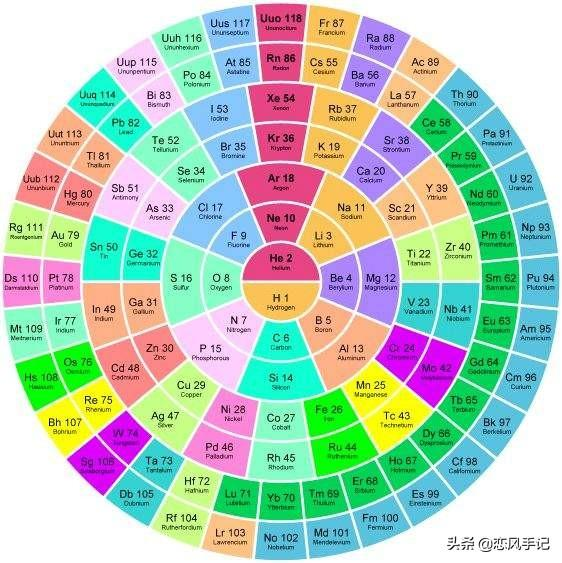
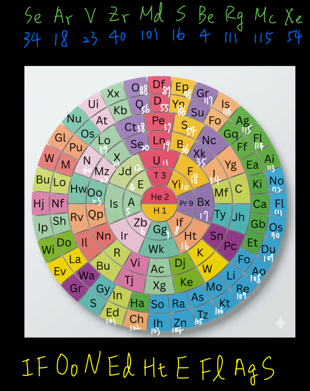

# Anatomically Incorrect

## 題目描述

Hey, I found this random assortment of characters on the ground in class. What does it mean?

1s2 2s2 2p6 3s2 3p6 4s2 3d10 4p4 1s2 2s2 2p6 3s2 3p6 1s2 2s2 2p6 3s2 3p6 4s2 3d3 1s2 2s2 2p6 3s2 3p6 4s2 3d10 4p6 5s2 4d2 1s2 2s2 2p6 3s2 3p6 4s2 3d10 4p6 5s2 4d10 5p6 6s2 4f14 5d10 6p6 7s2 5f13 1s2 2s2 2p6 3s2 3p4 1s2 2s2 1s2 2s2 2p6 3s2 3p6 4s2 3d10 4p6 5s2 4d10 5p6 6s2 4f14 5d10 6p6 7s2 5f14 6d9 1s2 2s2 2p6 3s2 3p6 4s2 3d10 4p6 5s2 4d10 5p6 6s2 4f14 5d10 6p6 7s2 5f14 6d10 7p3 1s2 2s2 2p6 3s2 3p6 4s2 3d10 4p6 5s2 4d10 5p6

This challenge does not contain boroCTF in the solution. Please put in the format boroCTF{ExAmPlE}

## 解題思路

1. **第一步**：

    經過高中三年的荼毒，用膝蓋應該也能看出來這是電子組態：

    ```text
    1s2 2s2 2p6 3s2 3p6 4s2 3d10 4p4   Se
    1s2 2s2 2p6 3s2 3p6   Ar
    1s2 2s2 2p6 3s2 3p6 4s2 3d3   V
    1s2 2s2 2p6 3s2 3p6 4s2 3d10 4p6 5s2 4d2  Zr
    1s2 2s2 2p6 3s2 3p6 4s2 3d10 4p6 5s2 4d10 5p6 6s2 4f14 5d10 6p6 7s2 5f13  Md
    1s2 2s2 2p6 3s2 3p4  S
    1s2 2s2  Be
    1s2 2s2 2p6 3s2 3p6 4s2 3d10 4p6 5s2 4d10 5p6 6s2 4f14 5d10 6p6 7s2 5f14 6d9  Rg
    1s2 2s2 2p6 3s2 3p6 4s2 3d10 4p6 5s2 4d10 5p6 6s2 4f14 5d10 6p6 7s2 5f14 6d10 7p3  Mc
    1s2 2s2 2p6 3s2 3p6 4s2 3d10 4p6 5s2 4d10 5p6   Xe

    SeArVZrMdSBeRgMcXe
    ```

    但這不是flag，題目有給另一張對照表。

2. **第二步**：

    我稍微查了一下，發現題目給的對照表是這種表的變體：

    

    只是一般的表外圈是順時針，題目給的是逆時針，並且題目的對照表往左偏移了一格。

    剩下的就是手動對照了。

    

## Flag

```text
boroCTF{IFOoNEdHtEFlAgS}
```
