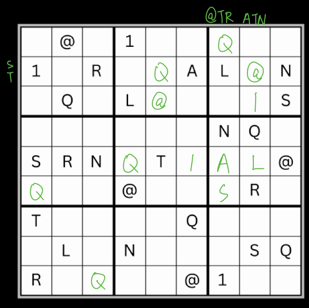
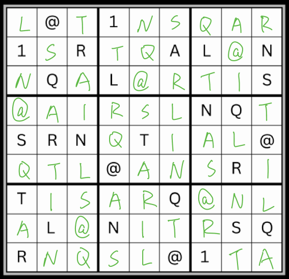

# Efficient Encryption

## 題目描述

I forgot my flag on the top shelf but i'm too short to reach it :'(. Can you grab it for me?

Note - This challenge does not contain the flag format. Example answer: boroCTF{S0lv3d}

## 解題思路

數獨題，依照題目的意思應該是解完之後第一列就是 flag。



但是這題出超爛的，解到這裡之後就沒辦法繼續解了(如果有解的話那就是我太菜，我跟作者道歉)。

反覆解了幾次還是卡住，最後只能二猜一，試了幾次之後就解出來了，檢查後也是對的。



## Flag

```text
boroCTF{L@T1NSQAR}
```
