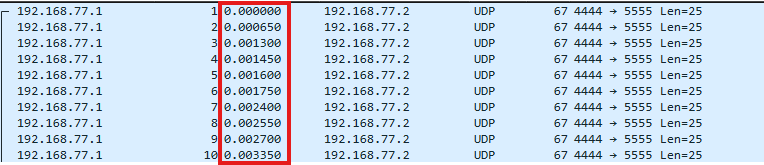

# Blackwall Protocol

## Description

We managed to intercept a raw, unfiltered braindance (BD) datastream right before the target crossed the Blackwall. The raw feed is heavily corrupted, but our netrunners swear there's something in the machine.

## Solution Walkthrough

It seems that `bd_tuner.py` is not very useful. Additionally, using `file`, we can find that `david_last_moments.bd` is a pcap capture file.

Then, open it with Wireshark. The UDP Stream inside only shows repeated `ARASAKA_NEURAL_LINK_FRAME` messages, while the TCP part is an ext4 filesystem image.

After trying for a long time, I realized that `bd_tuner.py` is actually useful. The following code snippet seems to refer to packet delay:

```py
delay = random.choice([0.15, 0.65]) # Matches our timing channel delays!
```

I looked at the delays, and they were consistently either 0.00015 seconds or 0.00065 seconds different. So, I assumed that a difference of 0.00015 corresponds to 0, and a difference of 0.00065 corresponds to 1. After decoding, that was the flag.



## Flag

```text
boroCTF{s4nd3v1st4n_gh0st_1n_th3_m4ch1n3_8f92a}
```
