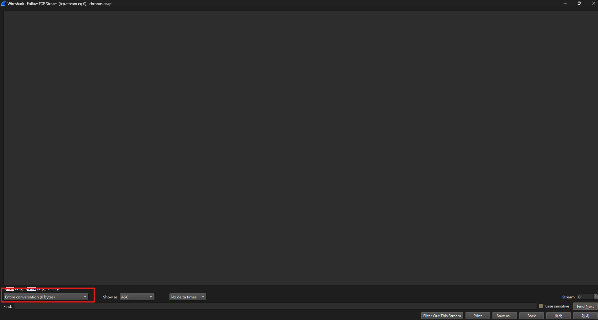

# Chronos

## Description

Would you rather posess the powers of Chronos, the God of Time or posess the powers of a bilingual?

## Solution Walkthrough

Open `chronos.pcap` with Wireshark. It only contains a bunch of TCP packets, and no data was seen after clicking "follow".



After gaining experience from the `blackwall protocol` challenge, I checked the delays and found that they were either 0.25 seconds or 0.75 seconds. So, I assumed that a 0.25 second difference means 0, and a 0.75 second difference means 1. After decoding, that's the flag.

## Flag

```text
boroCTF{c0mbobulat3_sp@gh3tti_nep0t1$m}
```
