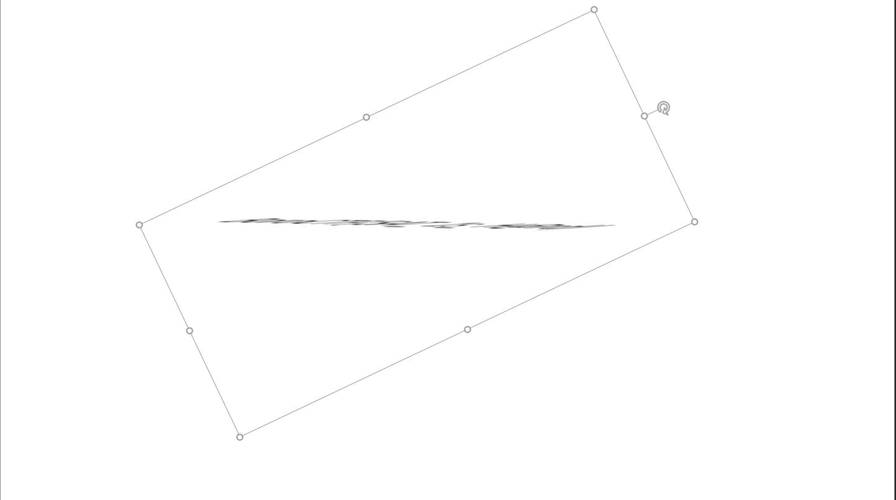
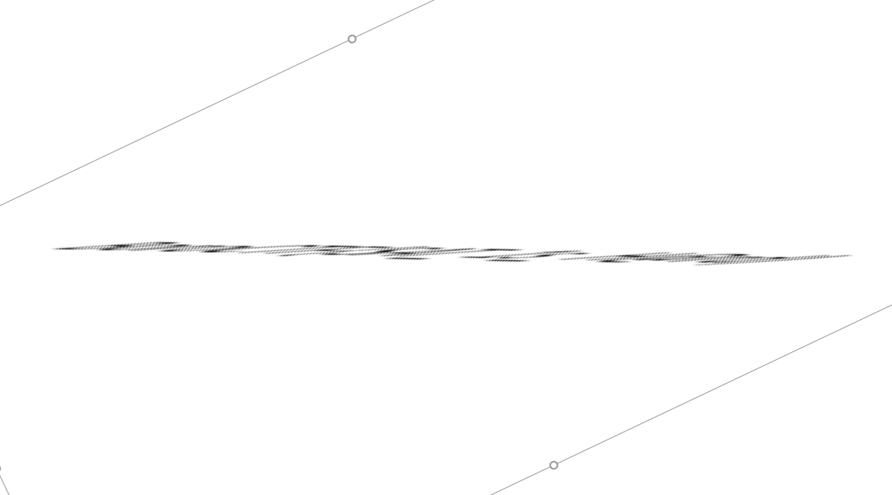
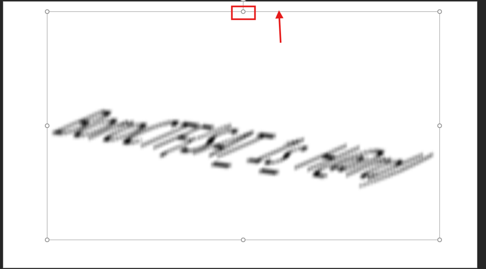

# Eschew

## 題目描述

My image is flipped and flopped :(.

## 解題思路

我是用 PowerPoint 解的，第一步是讓黑色的線變水平的



接著截圖，這樣之後才能拉高 flag 的 y 軸



再把 y 軸拉高，即可看出 flag 大致的樣子



其中最前面很清楚可以知道是 `BoroCTF{S?T_1s_H@??}`，其中 SAT 的 A 有點像 4，所以我先猜他是 A

`H@??` 的後面兩個字元我看的沒有很清楚，但依照字面上的意思他應該是 H@rd，最後湊出的 flag 即為 `BoroCTF{SAT_1s_H@rd}`

## Flag

```text
BoroCTF{SAT_1s_H@rd}
```
