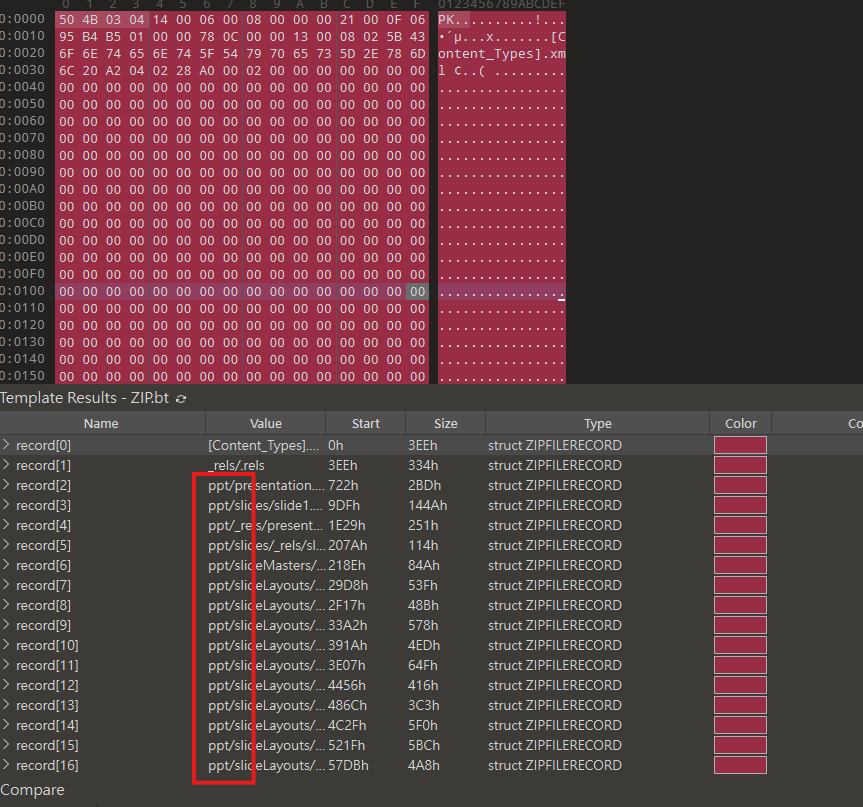

# kitty kitty meow meow

## Description

Frank sinatra accidentally deleted the file extension on one of his files!!!

What file extension is it supposed to be???

> boroCTF{file_extension}

## Solution Walkthrough

After opening with a hex editor, it's obvious that it's a PowerPoint file.



Next, we need to determine if it's a PPT, PPTX, or something else. By using `file`, we can see it's a 2007+ file, so the file extension is PPTX.

```text
┌──(kali㉿kali)-[~/Desktop]
└─$ file superfile       
superfile: Microsoft PowerPoint 2007+
```

## Flag

```text
boroCTF{pptx}
```
