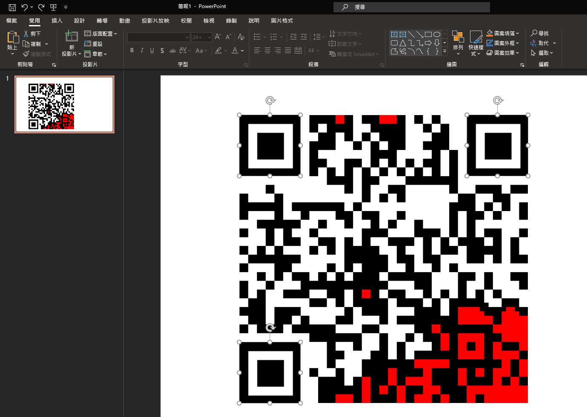

# Judgment of Solomon

## 題目描述

The birth of reconstruction.

## 解題思路

可以看到 code 裡面有藏一段字串 `boroCTF{I_C0xL6n"+_d0_it_St11nz_n0w_go}`，但是那個不是 flag

後來試了很多方法，直到我想說可以用色碼的方式，`FFFFFF` 是白色，`000000` 是黑色，`FF0000` 是紅色，`0A` 代表換行，照這個規則就可以得到一個看起來像是 qrcode 的東西

產生出 `code.png` 以後可以發現左上右上左下的正方形框框都不見了，所以用 PowerPoint 把框框補上以後即可取得 flag

正方形框框只需要在 google 上面找 "qrcode" 即可看到



## Flag

```text
boroCTF{I_f1%ed_wHat_w4$_br0Ken}
```
