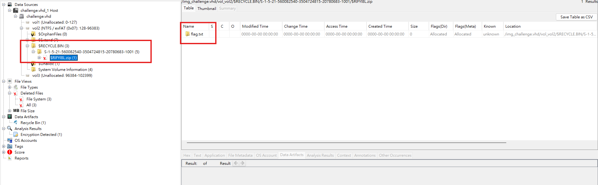

# Looking through Windows

## Description

My friend thinks he can hide his secrets from me by deleting them...

Who's gonna tell him?

## Solution Walkthrough

Using `strings -el challenge.vhd` (using -el because NTFS filenames are usually UTF-16LE), several suspicious files can be found: `$IIFYI8L.zip`, `flag.zip`, `$RIFYI8L.zip`.

A quick search online reveals that `$Ixxxx.ext` is file metadata, and `$Rxxxx.ext` is the body of a deleted file. Therefore, it can be inferred that `$RIFYI8L.zip` is the deleted `flag.zip`. A quick look with Autopsy allows us to see and extract `$RIFYI8L.zip`.



I then discovered that this zip file is password-protected. Using our old friend `john`, the password can be cracked to get the flag. The password is `forget92936281`.

## Flag

```text
boroCTF{f!l3_f0r3nsics_FTW!!}
```
