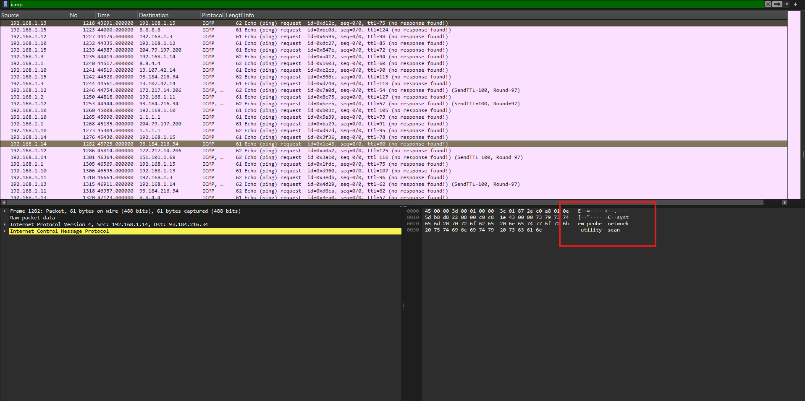
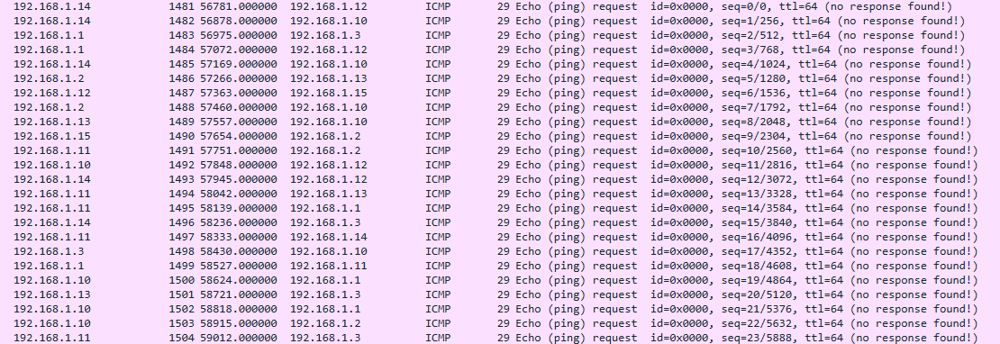

# Meeting Location

## Description

I've got the network traffic from a well-known athlete. We don't know who the athlete is yet, but we'll address that after we confirm where they are meeting the other party. You know he will pay big bucks if we can get pictures of this athlete and why they are there for him. They're definitely talking in code about a secret meeting place in these packets. Take a look when you have a second. If you can figure out where they are heading, there's 200 boroPoints in it for you. This could be the end of all our suffering if we figure this out.

Note: the flag will NOT be wrapped with boroCTF{}

## Solution Walkthrough

Let's start by looking at ICMP. Most of the packets don't contain much useful information.



However, there's a bunch of packets with only 1 byte payloads, and they are in order.



Concatenating those payloads gives `WWFzX01hcmluYV9DaXJjdWl0`. After base64 decoding, we get `Yas_Marina_Circuit`. Adding boroCTF{} to it yields the flag.

## Flag

```text
boroCTF{Yas_Marina_Circuit}
```
