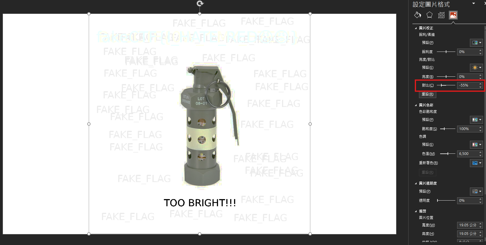
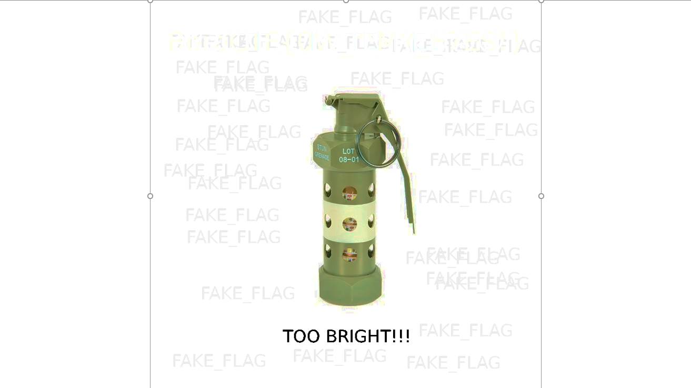
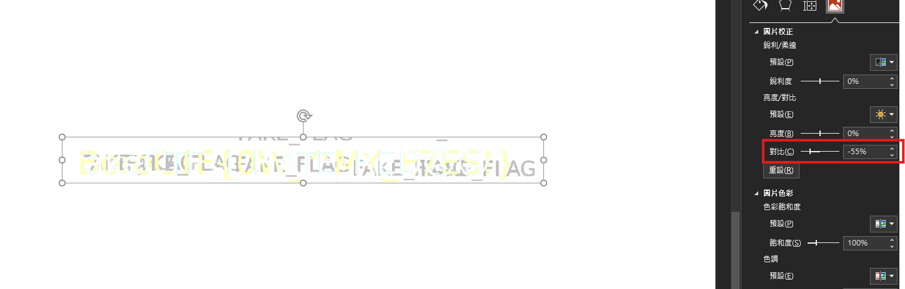
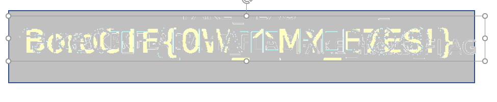

# Retinal Burn

## 題目描述

My friend Jonas Wagner sent me a challenge but I can't be bothered to do it. He was always one to be working on his own sorts of projects and stuff. You do it.

## 解題思路

圖片上面說 too bright，於是就用 PowerPoint 調整了一下，可以發現在對比是 -55% 時可以看到圖片正上方有淺藍色的 fake flag 以及淡黃色的真 flag



接著使用 PowerPoint 的色彩 -> 設定透明色彩，選擇淡藍色，這樣就只會留下淡黃色的真 flag 了



接著螢幕截圖，同樣再將對比度設為 -55%



最後如果你還是看不清楚的話就去插入 -> 圖案，並選擇正方形，將他的顏色設為 fake flag 的灰色，之後選定剛剛截圖下來的圖片，使用 PowerPoint 的色彩 -> 設定透明色彩，並選擇白色，最後把他移到最上層，並放在正方形上面即可清楚看到 flag



## Flag

```text
BoroCTF{0W_^MY_E7ES!}
```
