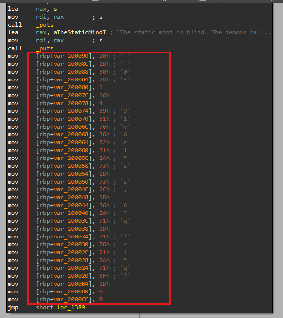
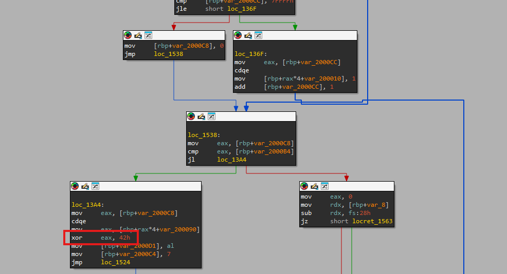

# Satoshi: A Memory of The Past

## 題目描述

All these crimes. Its not him. His soul is gone. It took his soul and trapped it inside the cache. I still hear his pulse.... Please don't lose his memory. I can't live without my beloved Satoshi.

> Satoshi's wife, Yukiko Nakamuda

(Note: the flag is already wrapped in boroCTF{} when you find it)

**UNRELATED TO THE OSINT CHALLENGES** *(other than the plot)*

## 解題思路

觀察一下可以發現有一堆東西，感覺像是一個 array



往下面可以看到把資料和 0x42 XOR 以後即為 flag



## Flag

```text
boroCTF{s4t0sh1_1n_th3_c4ch3}
```
