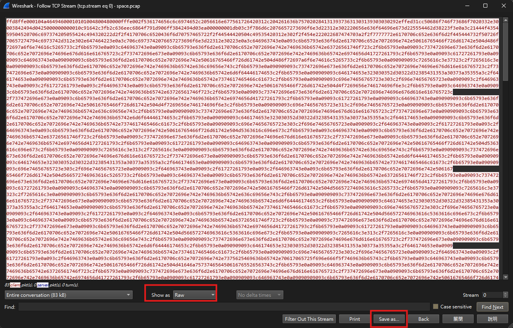

# Silent Sentinel

## 題目描述

We intercepted a packet capture containing a mix of modern station telemetry and an anomalous TCP file transfer. Analysts believe the rogue uplink successfully recovered an image of an iconic historical spacecraft where the crime must have taken place originally.

> Flag Format: boroCTF{satellite_name_with_underscores}

## 解題思路

用 wireshark 把他打開，可以看到有 UDP 和 TCP，先 follow UDP 的封包，沒得到有意義的資料，都是 `{"sensor": "ALT", "altitude_km": 421.9709}` 之類的

而 follow TCP 的話可以看到 JPG 的 header，把他匯出以後就是 `out.jpg`



最後用 exiftool 就可以看到 comment 裡面就是衛星的名稱 `Satellite, Vanguard 1, Backup (A19761019000)`

## Flag

```text
boroCTF{Vanguard_1}
```
