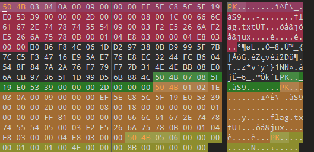

# File File Crocodile

## Description

We managed to snap a picture of the infamous File File Crocodile, but right before the flash went off, he swallowed a locked archive containing our flag! He's a master of disguise and his stomach acid has slightly digested the file signatures. Interrogating him didn't work as the only word he seemed to know was "croc".

Can you cut him open, perform some surgery, and get our archive back?

## Solution Walkthrough

It can be seen that the original zip's PK header was replaced with FC. After fixing it, use the password `croc` to extract the zip file and obtain the flag.



## Flag

```text
boroCTF{n3v3r_sm1l3_4t_4_p0lygl0t_cr0c0d1l3}
```
