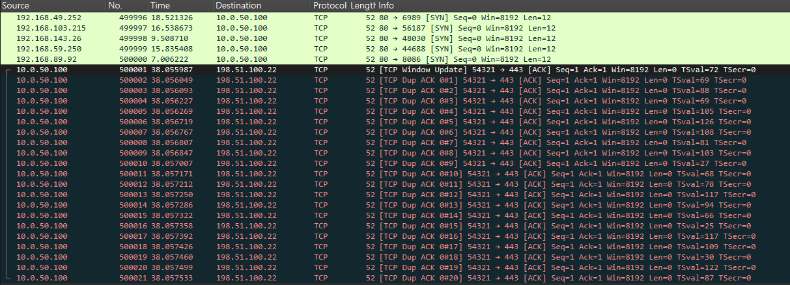
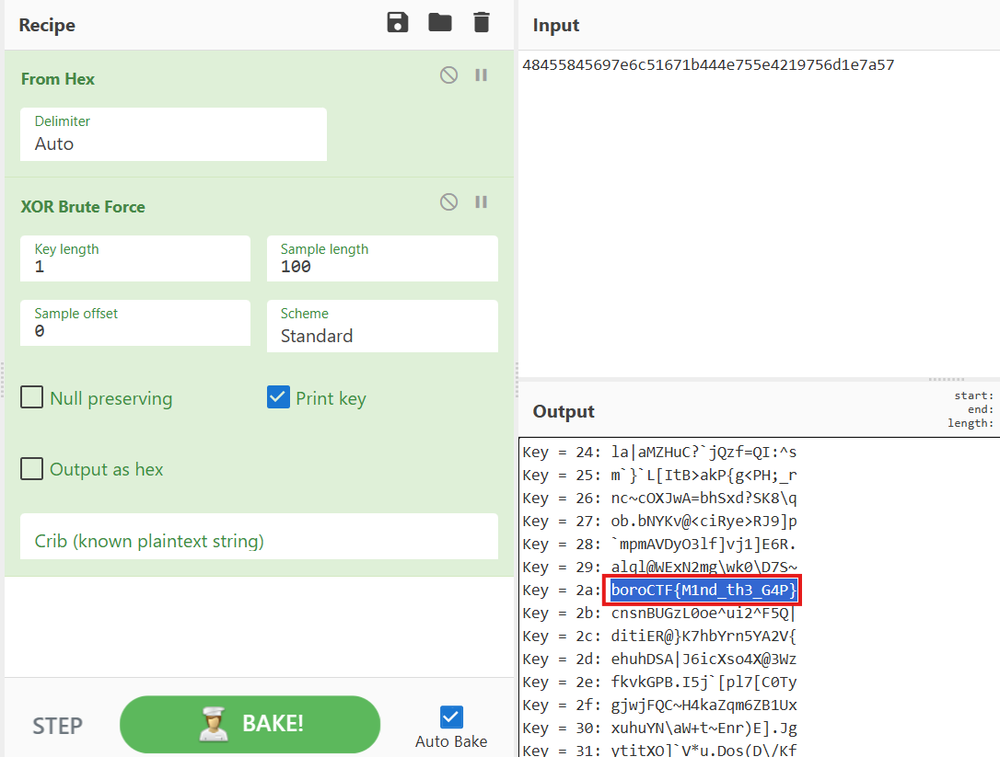

# Phantom

## Description

We managed to tap the line between Apex Renewable Energy's DMZ and their internal database segment.

Find out what is really governing Apex Energy's internal routing and recover the exfiltrated flag.

Do you get the gist of this challenge?

## Solution Walkthrough

After opening it with Wireshark, you can see a large number of TCP packets, where the data of each is `junk_traffic`. There are also AX4000 packets, but they are meaningless as well.

Scrolling to the very bottom, you can find 21 suspicious packets. Although they do not have normal payloads, the Timestamps in the TCP options are all different.



Extracting them gives `48 45 58 45 69 7e 6c 51 67 1b 44 4e 75 5e 42 19 75 6d 1e 7a 57`. At this point, it wasn't clear what to do next. After asking AI, it suggested it might have been XORed, so I used [CyberChef](https://cyberchef.io/#recipe=From_Hex('Auto')XOR_Brute_Force(1,100,0,'Standard',false,true,false,'')&input=NDg0NTU4NDU2OTdlNmM1MTY3MWI0NDRlNzU1ZTQyMTk3NTZkMWU3YTU3) for XOR brute force and obtained the flag.



## Flag

```text
boroCTF{M1nd_th3_G4P}
```
