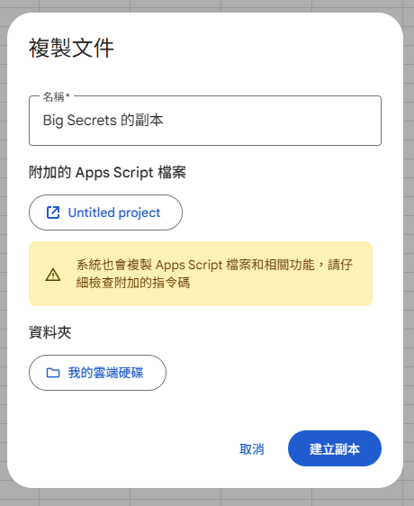
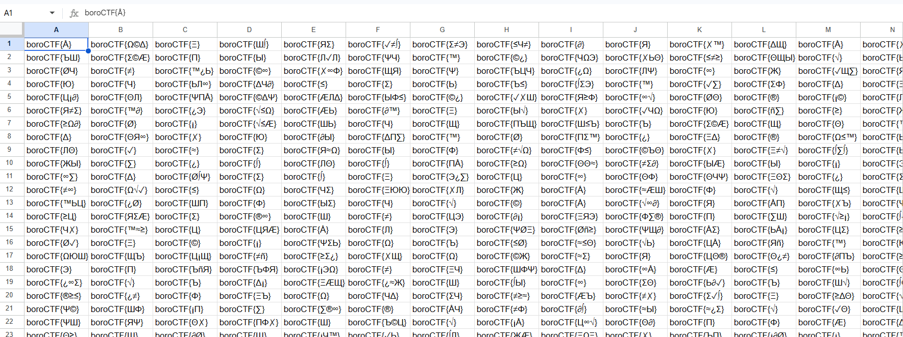

# tuff ash challenge

## 題目描述

A lexander is a master at hiding his secrets! Oh... nevermind. Well at least you can't find his favorite one of them all! At least... not E veryone can...

https://docs.google.com/spreadsheets/d/1rivkwPvDg_qCnFHfgLdLlKXPEgZpzNPflt7BaGP9Nd8/edit?usp=sharing

NOTE: (Only 5 guesses be careful!)

## 解題思路

打開試算表可以看到有兩個工作表，分別為 `Money stuff to rule the world I guess` 和 `hidden xander secrets`，其中後者因為被隱藏了，所以需要建立副本才看的到

建立副本的時候可以看到他有 app script，而內容如下



```js
function fillDecoyFlags() {
  var ss = SpreadsheetApp.getActiveSpreadsheet();
  var sheet = ss.getSheetByName("hidden xander secrets");
  
  // Failsafe: Ensures it ONLY runs on the specific sheet
  if (!sheet) {
    SpreadsheetApp.getUi().alert("Error: 'hidden xander secrets' sheet not found!");
    return;
  }

  // Set the size of your haystack grid (100 rows by 26 columns = 2,600 cells)
  var numRows = 100;
  var numCols = 26;
  var range = sheet.getRange(1, 1, numRows, numCols);

  // A pool of "weird" random characters (Greek, Spanish, Math, etc.)
  var weirdChars = "ÆØÅΩΣΨΔΘΞΦΣΠЛЖЦЧШЩЪЫЬЭЮЯñ¿¡©®™✓✗∞≈≠≤≥∑∫∂√";
  var values = [];

  // Generate the fake flags
  for (var r = 0; r < numRows; r++) {
    var row = [];
    for (var c = 0; c < numCols; c++) {
      // Pick a random length between 1 and 3 characters for the inside of the flag
      var flagLen = Math.floor(Math.random() * 3) + 1;
      var randomText = "";
      
      for (var i = 0; i < flagLen; i++) {
        var randIndex = Math.floor(Math.random() * weirdChars.length);
        randomText += weirdChars.charAt(randIndex);
      }
      
      row.push("cyber{" + randomText + "}");
    }
    values.push(row);
  }

  // Push all the generated flags to the sheet at once (much faster than cell-by-cell)
  range.setValues(values);
}
```

從這個 script 裡面找不到線索，且 `hidden xander secrets` 裡面全部都是假的 flag



嘗試了很久，我從題目的敘述發現了奇怪的地方，它的 `A lexander` 和 `E veryone` 當中，可以看到字首是 `A` 和 `E`，合起來就是 `AE`，而上面程式碼中的 wierdChars 裡面正好有 `Æ`

去查這個符號以後發現他的讀音就是 ash，而題目標題正好是 `tuff ash challenge`，於是我便確定 flag 就是 `boroCTF{Æ}`

## Flag

```text
boroCTF{Æ}
```
