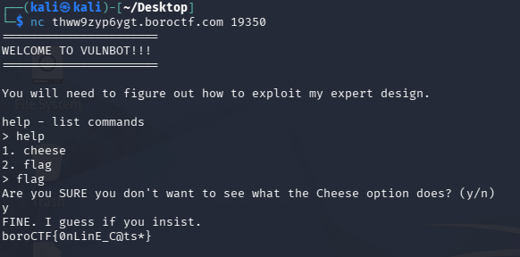

# Next Challenge

## Description

Psst...I've been hearing some rumors about this special command called nc. I don't know what it is so I have to assume it means Next Challenge ... right?? Maybe that MAN has more answers.

```text
nc thww9zyp6ygt.boroctf.com 19350
```

## Solution Walkthrough

After entering, first use `help` to see what commands are available; I found `cheese` and `flag`.

If you choose `cheese`, you will fall into a trap, be ruthlessly mocked, and then disconnected (I didn't manage to take a screenshot).

If you choose `flag`, it will then ask if you want to see the `cheese`. Selecting `n` will allow you to get the flag. (If you choose `y`, it’s highly likely it will just be another face-to-face slap and a disconnection.)



## Flag

```text
boroCTF{0nLinE_C@ts*}
```
