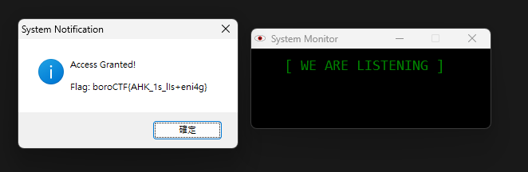

# George Orwell

## Description

Big Brother says: We're always watching. Your words, no matter how silent, will be heard.

Note - This challenge simulates real malware but contains NO malicious payloads.

## Solution Walkthrough

This is a Windows executable. Using `strings` reveals:

```text
Gui, Add, Text, w250 Center, [ WE ARE LISTENING ]
Gui, Show, w300 h100, System Monitor
return
:*:iloveboroctf::
secret := Chr(98) . Chr(111) . Chr(114) . Chr(111) . Chr(67) . Chr(84) . Chr(70) . Chr(123)
secret := secret . Chr(65) . Chr(72) . Chr(75) . Chr(95) . Chr(49) . Chr(115) . Chr(95)
secret := secret . Chr(108) . Chr(73) . Chr(115) . Chr(43) . Chr(101) . Chr(110) . Chr(105)
secret := secret . Chr(52) . Chr(103) . Chr(125)
MsgBox, 64, System Notification, Access Granted!`n`nFlag: %secret%
```

### Solution 1

Simply input `iloveboroctf` to get the flag.



### Solution 2

The `secret` is the flag; convert the ASCII to text to obtain the flag.

## Flag

```text
boroCTF{AHK_1s_lIs+eni4g}
```
