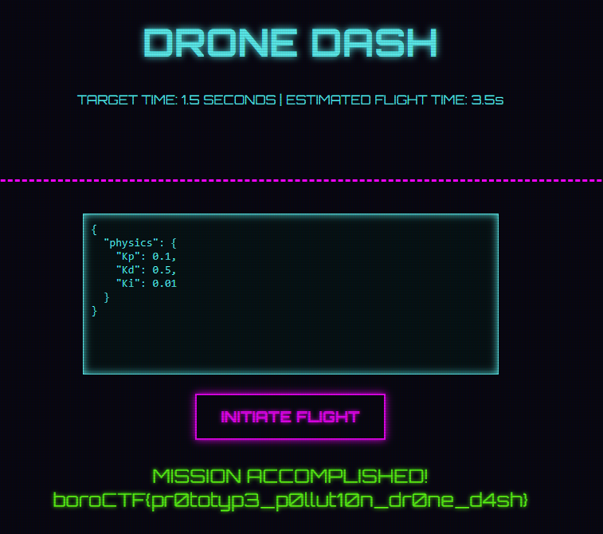

# Drone Dash

## 題目描述

Welcome to the neon grid, pilot. Your objective is simple: Land the drone on the pad in under 1.5 seconds.

https://697vj046dbi3.boroctf.com

## 解題思路

我不知道這題在幹嘛，但是用他預設給的參數即可得到 flag



## Flag

```text
boroCTF{pr0totyp3_p0llut10n_dr0ne_d4sh}
```
