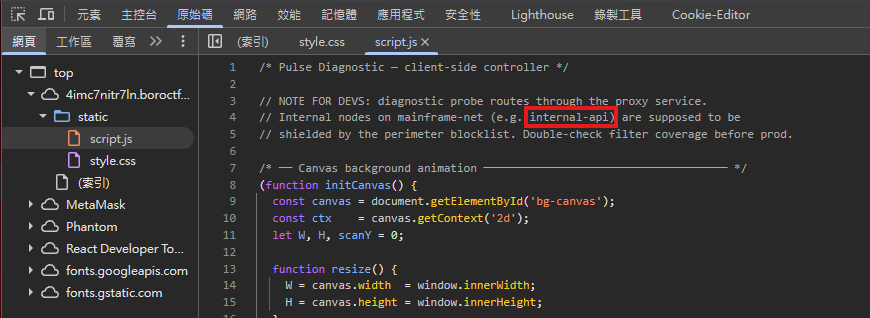

# boro-senpai 2

## 題目描述

Maine's dead. Lucy's gone dark. David-... you know what happened. There's nothing we can do now.

You're the last one standing with a half-finished contract and nothing left to lose.

Arasaka's internal data relay is locked behind a blocklist — but their own NetPulse uptime checker is still live on the public net.

Plug in. Pull the flag. Get out.

https://4imc7nitr7ln.boroctf.com/

## 解題思路

打開 developer tool 可以看到它的內部節點



於是先用 `http://internal-api/`，並得到回應，看到了 flag 的路徑

```json
STATUS 200 :: RESPONSE RECEIVED
────────────────────────────────────────────────────
{"endpoints":["/","/flag"],"node":"internal-api","notice":"CLASSIFIED \u2014 INTERNAL NETWORK ONLY","status":"operational","system":"ARASAKA INTERNAL DATA RELAY"}
```

然後就去 `http://internal-api/flag` 即可得到 flag

```json
STATUS 200 :: RESPONSE RECEIVED
────────────────────────────────────────────────────
{"classification":"TOP SECRET","flag":"boroCTF{w1sh_w3_c0uld_g0_2_th3_m00n_t0g3th3r}","message":"MAINFRAME BREACH CONFIRMED \u2014 CLASSIFIED DATA EXFILTRATED"}
```

## Flag

```text
boroCTF{w1sh_w3_c0uld_g0_2_th3_m00n_t0g3th3r}
```
