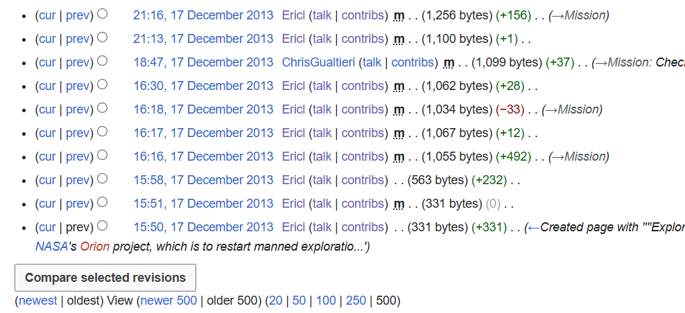

# One Small (13 Year Old Edit) for Mankind

## 題目描述

"So, here we are and here I am. Exactly what I'm going to do here is a mystery, although editing wikipedia is addicting." - my friend, a genius predictor

Baltimore, Maryland
Pomona, California
Grand Rapids, Michigan
London, Ontario, Canada
Find the username of the author and the date of the edit.

Format: boroCTF{SolarityPy_April_20_1967}

## 解題思路

用 google 查 `Baltimore Maryland Pomona California Grand Rapids Michigan London Ontario`，也就是上面四個地點，會發現這是 Artemis II 的成員的出生地

接著因為題目說他的朋友很喜歡編輯維基百科，所以就去看編輯紀錄。根據題目我切到 13 年前，也就是 2013 的時候，可以發現一個名稱為 Ericl 的人修改了 Artemis II 的維基百科頁面



點進去 Ericl 的頁面，就可以看到 `So, here we are and here I am. Exactly what I'm going to do here is a mystery, although editing wikipedia is addicting.`，跟題目敘述的一模一樣

## Flag

```text
boroCTF{Ericl_December_17_2013}
```
