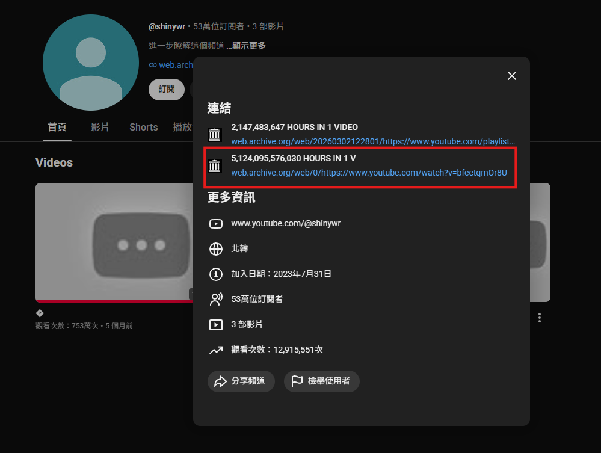

# Shiny

## Description

� 140 is NOTHING. oh wait. those aren't hours... Doesn't count that's impossible!

We need to go big or go home! These times are too little

Find the date of mdhdlimv2

Format: boroCTF{6/12/2026}

Format: boroCTF{month/day/year}

## Solution Walkthrough

First, use this to search for `"mdhdlim"` on Google; there is only [one result](https://www.youtube.com/@shinywr).

This website introduces a YouTube channel called shinywr, but I didn't see any video, playlist, or post titled `mdhdlimv2` within that channel.

Later, I discovered a Wayback Machine link in his bio with the title `5,124,095,576,030 HOURS IN 1 V`.



Clicking into the live stream, the title is `mdhdlimv2`. Since it was published on 2026/04/06, the flag is `boroCTF{4/6/2026}`.

## Flag

```text
boroCTF{4/6/2026}
```
